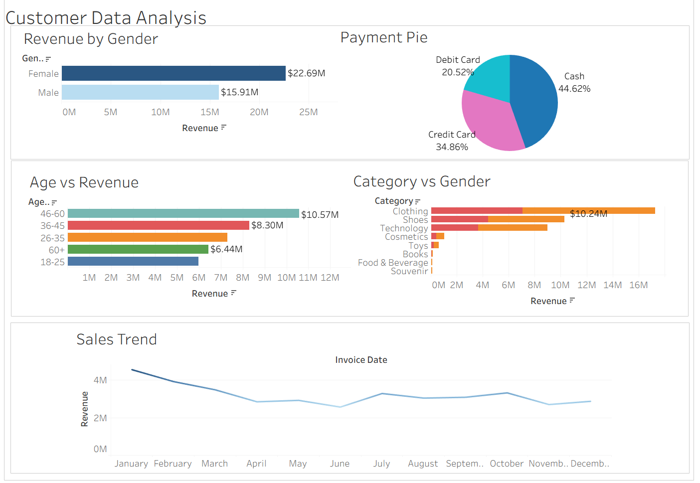

# Customer Data Analysis

## Project Overview

This project focuses on analyzing customer transaction data to uncover business insights related to customer demographics, purchasing behavior, revenue generation, and payment preferences.

The analysis was performed using SQL and Python, with visualizations created to support data-driven decision-making.

---

## Objectives

- Analyze customer purchasing patterns.
- Identify revenue trends across demographics.
- Understand customer age and gender distributions.
- Evaluate payment method preferences.
- Create visual dashboards for business insights.

---

## Technologies Used

- Python
- Pandas
- MySQL
- SQL
- Jupyter Notebook
- Matplotlib
- Seaborn

---

## Project Structure

```text
Customer-Data-Analysis/
│
├── Customer Data Analysis.ipynb
├── Customer Data Analysis.sql
├── Customer Data Analysis.docx
├── Customer-Data-Analysis.pptx.pptx
│
├── Customer_Dashboard.png
├── Sales Trend.png
├── Age vs Revenue.png
├── Gender vs Revenue.png
├── Category vs Gender.png
├── Payment Pie.png
│
└── README.md
```

---

## Data Analysis Workflow

### 1. Data Extraction
- Connected to a MySQL database.
- Retrieved customer transaction data.
- Imported data into Pandas DataFrames.

### 2. Data Cleaning
- Checked missing values.
- Verified data types.
- Performed exploratory data analysis.

### 3. Feature Engineering
Created a new revenue metric:

```python
revenue = price * quantity
```

Created age groups for customer segmentation:

- Teen
- Young Adult
- Adult
- Mid-Age
- Senior
- Elder

### 4. Data Visualization
Generated visual reports including:

- Sales Trend Analysis
- Revenue by Age Group
- Revenue by Gender
- Category vs Gender Analysis
- Payment Method Distribution
- Interactive Dashboard

---

## Key Insights

### Revenue Analysis
- Identified high-revenue customer segments.
- Analyzed spending patterns across age groups.

### Customer Demographics
- Examined customer distribution by age and gender.
- Compared revenue contribution among demographic groups.

### Payment Behavior
- Studied preferred payment methods.
- Visualized payment distribution using pie charts.

### Product Performance
- Evaluated category-wise customer engagement.
- Compared purchasing behavior across product categories.

---

## Dashboard Preview

### Customer Dashboard



---

## Visualizations

### Sales Trend


### Age vs Revenue


### Gender vs Revenue


### Category vs Gender


### Payment Distribution


---

## Business Value

This project demonstrates:

- SQL querying skills
- Data cleaning and preprocessing
- Exploratory Data Analysis (EDA)
- Data visualization
- Dashboard creation
- Business insight generation
- Customer segmentation analysis

---

## Author

**Your Name**

Aspiring Data Analyst | SQL | Python | Power BI | Data Visualization

LinkedIn: Add your profile link  
GitHub: Add your GitHub profile link